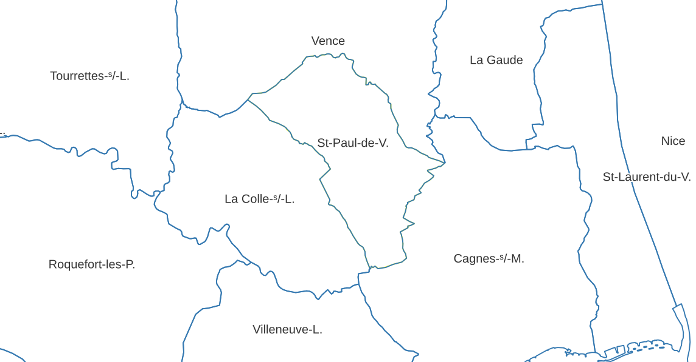

# French Locality Name Shortener - QGIS Plugin

Portage QGIS du programme [french-locality-name-shortener](https://github.com/bchartier/french-locality-name-shortener/tree/develop) de Benjamin et Julie CHARTIER permettant de créer des noms contractés de communes et arrondissements français.

Le plugin ajoute une fonction dans le moteur d'expression et un algorithme dans la boîte à outil.

## TODO
- [x] Fonction dans le moteur d'expression
- [ ] Algorithme dans la toolbox

----

## License

Distributed under the terms of the [`MIT` license](LICENSE).
